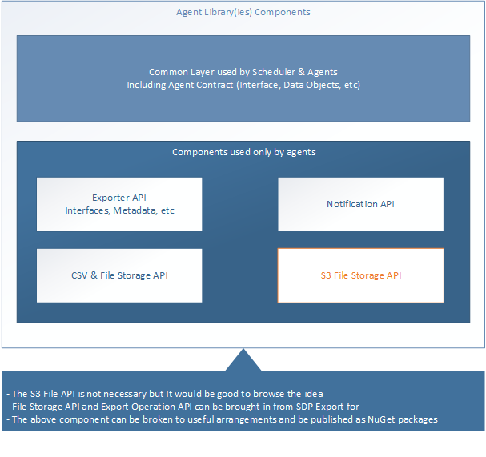
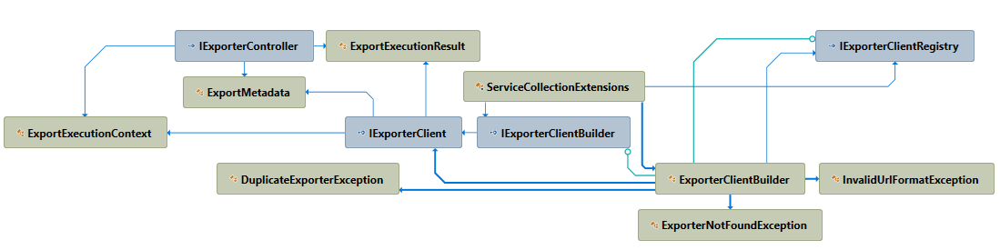

# Easify Exports

The repo contains a series of Easify componenets which are providing the export functionality of any data source to CsV files targeted to 
  - S3, 
  - Azure Blob
  - File Share 
  - In Memory file store
  - Or a combination of the targets 

It also send the notifications on success and error result to an Scheduler (which has been implemented the required interface).



## Common Layer

The client library provides the common structure which is shared between Domain & Scheduler API's. It contains Common and Client libraries.

### Client

The client library contains all the registration and client access library for the scheduler to talk to Exporters in different domain API.

```cmd
dotnet add package Easify.Exports.Client
```

or

```cmd
Install-Package Easify.Exports.Client
```

The **AddExporterBuilder** extension method will help on registering the required exporters

```c#
public class Exporters
{
    public string ExporterUrl1 { get; set; } = "http://localhost/export1";
    public string ExporterUrl2 { get; set; } = "http://localhost/export2";
}

services.AddExporterBuilder<Exporters>((builder, c) =>
{
    builder.AddClient("exporter#1", c.ExporterUrl1);
    builder.AddClient("exporter#2", c.ExporterUrl2);
});
```

Then _IExporterClientBuilder_ can be injected to the calling object which can build the _IExporterClient_ interface pointing to the target url.

```c#
builder.Build("name of the client")
```

### Agent

The Agent library contains all the registration and base services to provides Export functionality to each domains.

```cmd
dotnet add package Easify.Exports.Agent
```

or

```cmd
Install-Package Easify.Exports.Agent
```

Adding exporters metadata to the configuration will help to define multiple target source for the exporter so the exporter can export the files in multiple location.

```json
"Exporters": {
	"ExporterMetadata": [
	  {
		"ExportId": "04caca74-2453-4f16-99a0-8eb860cf8386", // Export ID can be a GUID
		"ExportName": "ExportName",
		"ExportDescription": "Export Description",
		"ExportSchedule": "* * * * *", // Cron Expression
		"StorageTargets": [
			{ "StorageTargetType": "S3Bucket", "TargetLocation": "A location in S3 bucket"},
			{ "StorageTargetType": "LocalDisk", "TargetLocation": "A file share location"},
			{ "StorageTargetType": "InMemory", "TargetLocation": "location in memory"} // Mainly for testing purpose
		]
	  }
	]
}
```


The **AddExporters** extension method for service collection should be used to provide registration for the Exporters.

```c#
services.AddS3BucketStorage(configuration); // Should be always here
services.AddCsv(c =>
{
    c.Register<SampleEntityMap, SampleEntity>(); // Add the mappings for each class here
});
services.AddExporters<Exporters>(c =>
{
    c.Register<SampleEntityExporter>(new ExporterMetadata());
});
```

The metadata can be retrieved from the registrations as follows:

```c#
_exporterRegistry.GetRegistrations()
```

There are classes such as **ExporterBase** or **CsvStorageExporter<T>** which can be used to provide the basic functions for Exporter.

```c#
public class SampleEntityExporter : CsvStorageExporter<SampleEntity>

{

    public SampleCsvExporter(IFileExporter fileExporter, IReportNotifierBuilder notifierBuilder,
                ILogger<CsvStorageExporter<Sample>> logger) : base(fileExporter, notifierBuilder, logger)
    {
        ...
    }

    protected override Task<IEnumerable<T>> PrepareDataAsync(ExportExecutionContext executionContext)
    {
        // Load and return the data here
    }
	
	protected virtual ExporterOptions CreateExporterOptions(ExportExecutionContext executionContext,
            StorageTarget[] storageTargets,
            IEnumerable<T> data)
	{
		return CreateDefaultOptions(executionContext, storageTargets);
	}

    protected override string ExportFilePrefix => "SampleDomain";
}

```

> NOTE: To override the as of date in the name of the output file, the *CreateExporterOptions* can be overridden.

### Common

This contains all the shared components between the scheduler and domain api.


In Each Domain API, The exporter controller should be implementing the _IExporterController_ to guarantee the contract which the scheduler is talking to each domain.

```c#
public interface IExporterController
{
    Task<ExportExecutionResult> ExecuteExportAsync(ExportExecutionContext executionContext);
    Task<IEnumerable<ExportMetadata>> DiscoverExportsAsync();
}

```

The discovery action provide metadata about which exports are available in each domain API. For invoking each export, The server send the ExportExecutionContext and expect an ExecutionResult.

```c#
public sealed class ExportExecutionContext
 {
     public ExportExecutionContext(Guid exportId, Guid exportExecutionId, DateTimeOffset asOfDate, string targetLocation, string successWebHook, string failWebHook)
     {
         ExportId = exportId;
         ExportExecutionId = exportExecutionId;
         AsOfDate = asOfDate;
         SuccessWebHook = successWebHook ?? throw new ArgumentNullException(nameof(successWebHook));
         FailWebHook = failWebHook ?? throw new ArgumentNullException(nameof(failWebHook));
     }

     public Guid ExportId { get; }
     public Guid ExportExecutionId { get; }
     public DateTimeOffset AsOfDate { get; }
     public string SuccessWebHook { get; }
     public string FailWebHook { get; }
}

public sealed class ExportExecutionResult
{
    public ExportExecutionResult(Guid exportId, Guid exportExecutionId)
    {
        ExportId = exportId;
        ExportExecutionId = exportExecutionId;
    }
    public Guid ExportId { get; }
    public Guid ExportExecutionId { get; }
}
```

## Libraries

This part contains the supporting libraries for the following areas

- Working with Storage (S3, Blobs and LocalFile)
- Provide Csv Export facilities

### Storage

The library provides a BlobStorage interface to underlying store such as S3 Buckets, Azure Blob, Physical Folder or InMemory. It is dependent to Storage.Net library to provide the functionality (See documentation here @ https://github.com/aloneguid/storage/blob/develop/doc/blobs.md)

It can be setup with installing the following package:

```cmd
dotnet add package Easify.Exports
or
Install-Package Easify.Exports
```

The following setup, register the related classes and configuration for S3 bucket store

```c#
services.AddS3BucketStorage(configuration);
```

Which the configuration is coming from your _appSettings.json_ with the following format

```json
"BucketOptions": {
  "Profile": "Profile name in .aws folder in user profile",
  "Region": "Aws region",
  "BucketName": "Name of the S3 Bucket"
}
```

or alternatively you can use the fluent API to change the options values

```c#
services.AddS3BucketStorage(configuration,
    o => o.WithProfile("ProfileName").InRegion("Region").ForBucket("BucketName"));
```

Then by injecting **IBlobStorage**, you can work with the underlying store for create, update or query the storage.

> **NOTE #1:** There are other extensions such as _AddLocalDiskStorage_ or _AddInMemoryStorage_ available for local file storage or even in memory which is suitable for unit and integration testing.

> **NOTE #2:** The same extensions have been provided for Autofac which is provided in _Easify.Exports.Autofac_ package.

### Csv Export

The csv facilities, enable the users to export a list of objects to a CSv representation of the data and store it into the underlying storage. This is highly dependent to CsvHelper (https://joshclose.github.io/CsvHelper) to provide different features.

To enable this for an application, install the package

```cmd
dotnet add package Easify.Exports
or
Install-Package Easify.Exports
```

Now by setting up the Csv related set of classes in the container, It can be used by calling applications:

```c#
services.AddS3BucketStorage(configuration); // Should be always here
services.AddCsv(c =>
{
    c.Register<SampleEntityMap, SampleEntity>(); // Add the mappings for each class here
});
```

Remember as Csv services are using BlobStorage, A blob storage registration needs to be done before. Now it ready to use. By injecting IFileExporter for the relevant class, It can be used to export any collection of objects to the any given location.

```c#
    public sealed class SampleDataExporter
    {
        private readonly IFileExporter _fileExporter;

        public SampleDataExporter(IFileExporter fileExporter)
        {
            _fileExporter = fileExporter;
        }

        public async Task ExportSampleDataAsync()
        {
            var entityList = // Prepare the list of objects for export
            var result =
                await _fileExporter.ExportAsync(entities, new ExporterOptions("as of date for filename creation", "target location in S3"));
        }
    }
```

**ExporterOptions** has some extra properties which are defaulted but it can be changed by the users.

```c#
        public string DateTimeFormat { get; set; } = ExporterDefaults.DefaultDateTimeFormat; // yyyy-MM-dd HH:mm:ss
        public string ColumnDelimiter { get; set; } = ExporterDefaults.DefaultColumnDelimiter; // |
        public string FileNameDateTimeFormat { get; set; } = ExporterDefaults.DefaultFileNameDateTimeFormat; // yyyyMMdd
```

